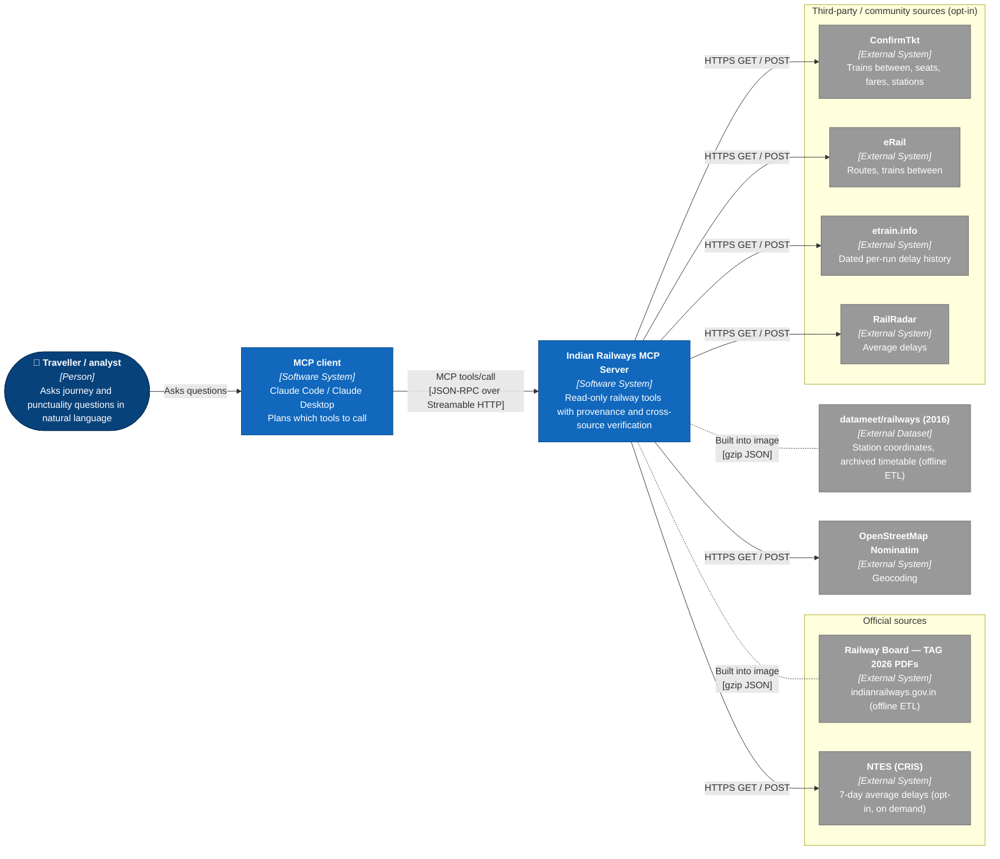

# Context and requirements

[← Design index](../README.md) · [Architecture →](02-architecture.md)

> **Diagram conventions:** C4 model (structure), UML sequence/class/deployment diagrams, ISO 5807-style flowcharts (rounded = start/end, rectangle = process, diamond = decision, parallelogram = I/O). Diagrams are Mermaid.

## Purpose and requirements

An MCP server that lets an LLM query and reason over Indian Railways data. The model composes small tools itself (stations, timetables, trains between stations, station boards, multi-train connections, nearby stations, punctuality history, seats and fares); there is no hard-coded journey planner. The source brief is [`REQUIREMENTS.md`](../../REQUIREMENTS.md).

## Requirements and design decisions

| ID | Requirement | Design decision |
|---|---|---|
| R1 | Never fabricate railway data | Providers return real data or throw a typed `RailError`. No failure becomes an empty "success" or a default value. Values that can't be determined are `null`. |
| R2 | Prefer authoritative, legally accessible sources | Official Railway Board timetable (*Trains at a Glance 2026*) is the primary timetable. Unofficial sources are **opt-in** (`ENABLE_UNOFFICIAL_SOURCES`). |
| R3 | Static facts confirmed by multiple sources before presentation | Live cross-source verification on every query, with a per-item `verification.status`. Unconfirmed values are shown but flagged. |
| R4 | Distinguish scheduled / estimated / actual timings | Timetable tools return `timing_kind: "scheduled"`. Punctuality figures are historical delays with period and run count. Seats and fares carry `observed_at`. |
| R5 | LLM composes tools for complex queries | 11 small read-only tools. `find_connections` is a bounded search building block, not a planner. |
| R6 | Robust: validation, errors, rate limits, caching | zod input schemas. Typed errors mapped to actionable tool errors. Per-upstream rate limiter, TTL cache and bounded retry. |
| R7 | Extensible: add providers without changing the MCP interface | Capability interfaces plus a `ProviderRegistry`. Tools never call a provider directly. |
| R8 | Zero cost, runs locally in Docker | Local datasets bundled in the image. No paid APIs. `docker compose` bound to `127.0.0.1`. |
| R9 | Know whether a train runs late historically (not live position) | `get_punctuality`: per-station delay statistics from dated past runs, cross-checked between sources. |

## Non-goals
Ticket booking, PNR status, live train position, and any write operation.

---

## System context (C4 Level 1)

| External system | Kind | Used for | Default |
|---|---|---|---|
| Railway Board TAG 2026 | Official timetable (PDF → offline ETL) | Stations, schedules, trains between, station boards, connections | On |
| datameet/railways (~2016) | Archived community dataset (offline ETL) | Station coordinates; fallback timetable flagged `possibly_outdated` | On |
| OpenStreetMap Nominatim | Geocoder | Place name → coordinates (`find_nearby_stations`) | On (`GEOCODER=off`) |
| ConfirmTkt | Unofficial web-app API | Trains between, seats (cached snapshots), fares, station search | Off |
| eRail | Unofficial web endpoints | Routes / schedules, trains between | Off |
| etrain.info | Unofficial HTML (inline JS data) | Dated per-run delay history (primary for punctuality) | Off |
| NTES | Official site, on-demand only | 7-day average delays (cross-check; never stored, ≤30 min cache) | Off |
| RailRadar | Unofficial internal JSON | Average delays (cross-check) | Off |

---

[← Design index](../README.md) · [Architecture →](02-architecture.md)
