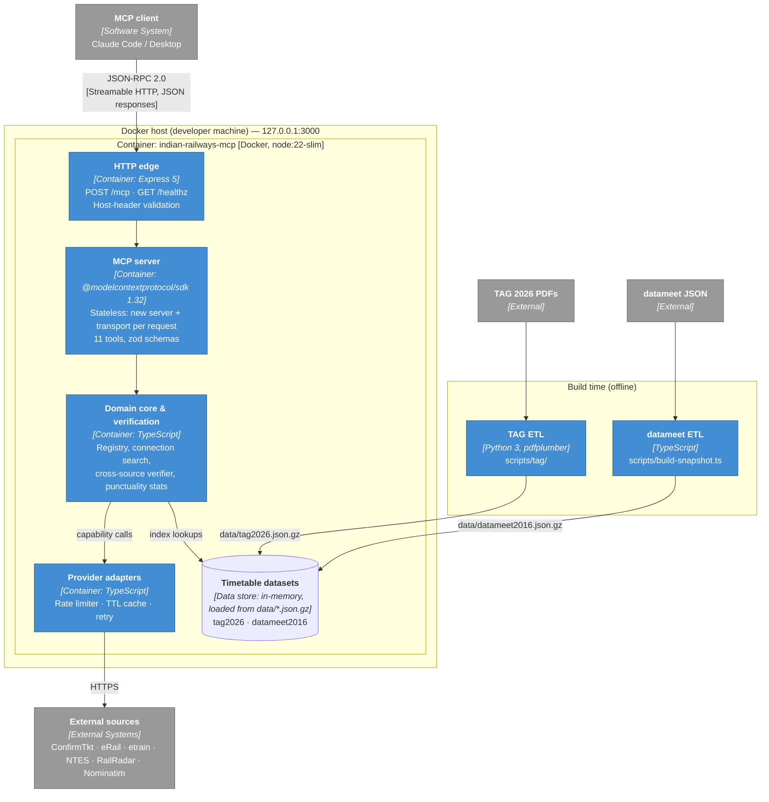
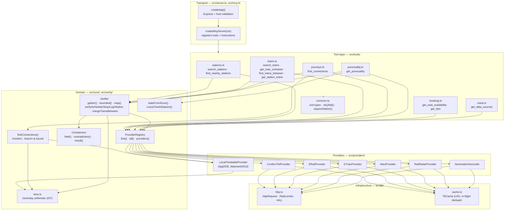

# Architecture

[← Design index](../README.md) · [← Context and requirements](01-context.md) · [Contracts and domain model →](03-contracts.md)

> **Diagram conventions:** C4 model (structure), UML sequence/class/deployment diagrams, ISO 5807-style flowcharts (rounded = start/end, rectangle = process, diamond = decision, parallelogram = I/O). Diagrams are Mermaid.

## Containers (C4 Level 2)

---

## Components (C4 Level 3)

## Tool catalogue

| Tool | Capability used | Verification | Notes |
|---|---|---|---|
| `search_stations` | `stations` | Coordinates across station sources | Name/code ranking, abbreviation-normalised |
| `find_nearby_stations` | `geocode`, local coordinates | Per station (budgeted) | Haversine distance; `trains_halting` as a connectivity signal |
| `search_trains` | `schedule` | `not_checked` (by design) | Discovery only; `get_train_schedule` verifies |
| `get_train_schedule` | `schedule` | Whole schedule, per stop | Origin-relative day numbers |
| `find_trains_between` | `trains_between` | Per train visit, merged across sources | Boarding-relative day numbers; filters for windows, duration, overnight, class, date |
| `get_station_trains` | `station_index` | Per row (budgeted) | `towards` / `coming_from` direction filters |
| `find_connections` | `station_index` | Per leg; journey takes the weakest | 2–3 trains, layover bounds, `via`, `works_on` |
| `get_punctuality` | `punctuality` | Per station, ±10 min with windows | Statistics from dated runs only |
| `get_seat_availability` | `availability` | `not_applicable` (volatile) | `observed_at` from source |
| `get_fare` | `fare` | `not_applicable` (volatile) | `observed_at` from source |
| `get_data_sources` | — | — | Active and disabled sources; today's date in IST |

All tools are annotated `readOnlyHint: true`, `destructiveHint: false`, with a `title`.

---

[← Design index](../README.md) · [← Context and requirements](01-context.md) · [Contracts and domain model →](03-contracts.md)
