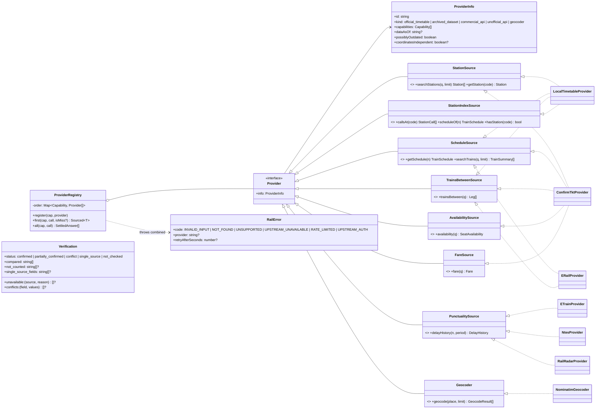
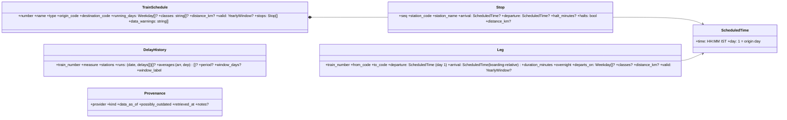

# Contracts and domain model

[← Design index](../README.md) · [← Architecture](02-architecture.md) · [Request flow and providers →](04-request-flow.md)

> **Diagram conventions:** C4 model (structure), UML sequence/class/deployment diagrams, ISO 5807-style flowcharts (rounded = start/end, rectangle = process, diamond = decision, parallelogram = I/O). Diagrams are Mermaid.

## Contracts (UML class diagram)

## Domain model

**Response fields added by `PRIMARY_SOURCE=confirmtkt`:**
- `verification.conflicts[].majority.differs: Array<{ source, value }>` and `majority.shared_upstream`: set only by the mirror rule (see [Verification](05-verification.md)). The shown value is the primary's; `differs` lists the other value, usually the printed timetable's. There is no matching entry under `corrections`.
- `search_stations` rows: `filled_from: { field: datasetId }` when a ConfirmTkt row's null `state`, `zone` or `lat`/`lon` was filled from the local datasets (official first, then the archive). ConfirmTkt's own values are never overwritten, and verification compares the sources' own values.
- `get_data_sources`: `primary_source` (`official` or `confirmtkt`) and `presented_first` (capability → the provider whose answer is presented first). Both are always present.

**Day conventions:** schedules use **origin-relative** days (`day 1` is the day the train leaves its origin). Legs use **boarding-relative** days (departure is always `day 1`; `arrival.day 2` means the next day). `departs_on` gives the weekdays the train leaves the *boarding* station, i.e. origin running days shifted by journey day.

---

[← Design index](../README.md) · [← Architecture](02-architecture.md) · [Request flow and providers →](04-request-flow.md)
