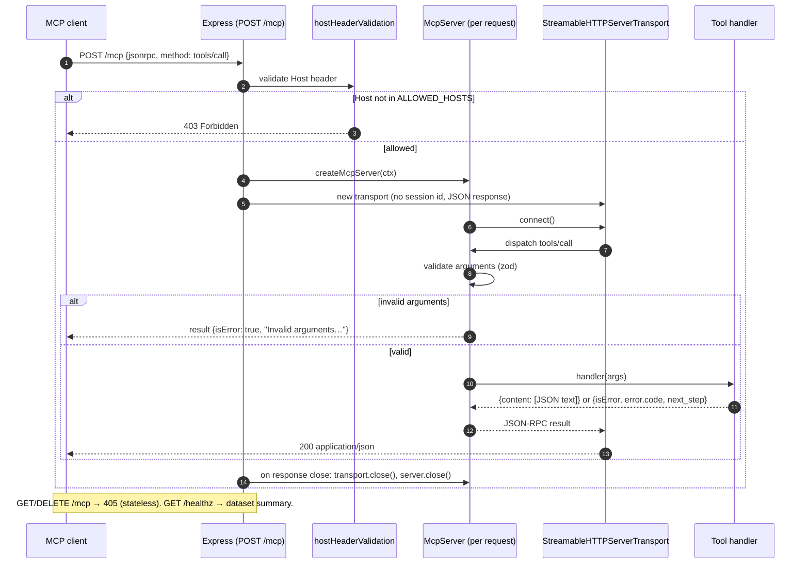
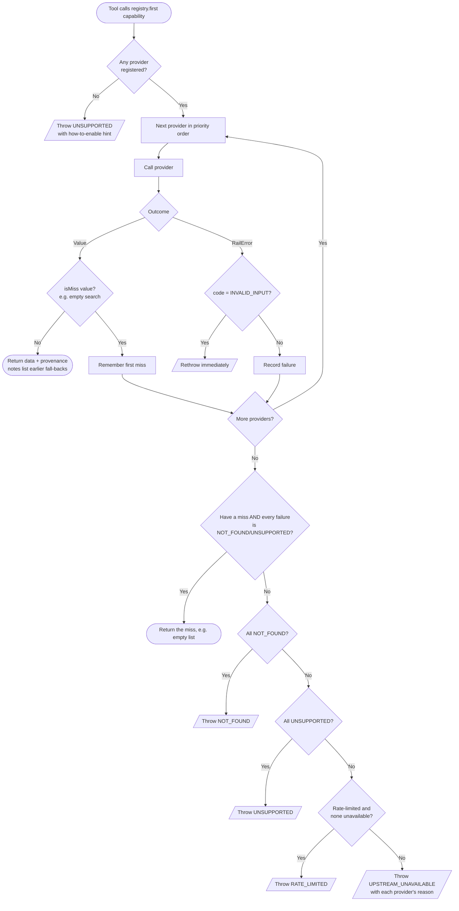
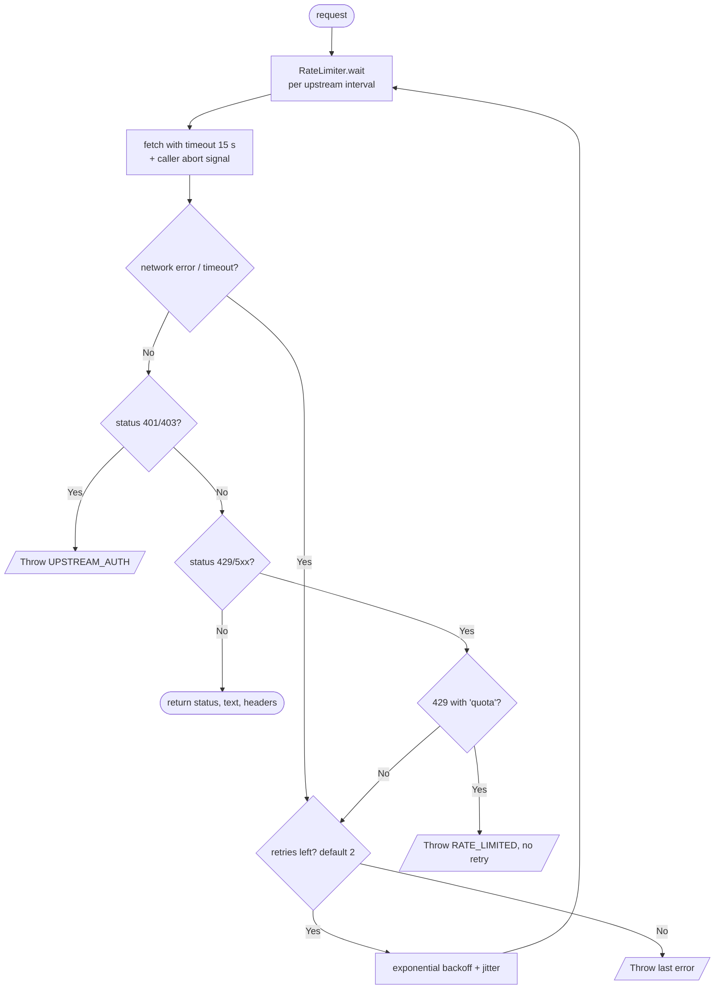

# Request flow and providers

[← Design index](../README.md) · [← Contracts and domain model](03-contracts.md) · [Cross-source verification →](05-verification.md)

> **Diagram conventions:** C4 model (structure), UML sequence/class/deployment diagrams, ISO 5807-style flowcharts (rounded = start/end, rectangle = process, diamond = decision, parallelogram = I/O). Diagrams are Mermaid.

## MCP request lifecycle (stateless Streamable HTTP)

---

## Provider chain with fall-through (`ProviderRegistry.first`)

**Priority order per capability** (`src/config.ts`): official timetable → current third-party sources → archived dataset.

| Capability | Order |
|---|---|
| stations | tag2026 → datameet2016 → ConfirmTkt |
| schedule | tag2026 → eRail → datameet2016 |
| trains_between | tag2026 → ConfirmTkt → eRail → datameet2016 |
| station_index | tag2026 → datameet2016 |
| punctuality | etrain → NTES → RailRadar |
| availability, fare | ConfirmTkt |
| geocode | Nominatim |

---

## Outbound HTTP (`httpRequest`)

| Upstream | Min interval | Cache TTL |
|---|---|---|
| ConfirmTkt | 1 s | search 5 min, stations 24 h |
| eRail | 1 s | routes 24 h, trains-between 30 min |
| etrain.info | 3 s | 12 h |
| NTES | 3 s | ≤ 30 min (hard cap; terms forbid storage); session 10 min |
| RailRadar | 3 s | 6 h |
| Nominatim | 1.1 s | 7 days |

The cache is an in-memory LRU (`TtlCache`) that merges concurrent misses for the same key into one upstream call.

---

[← Design index](../README.md) · [← Contracts and domain model](03-contracts.md) · [Cross-source verification →](05-verification.md)
