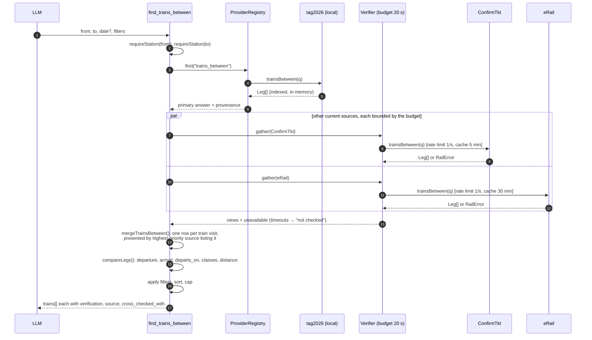
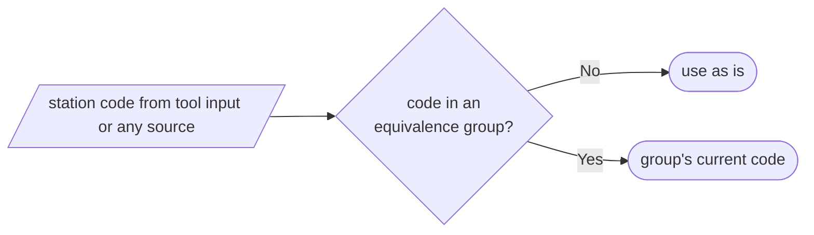
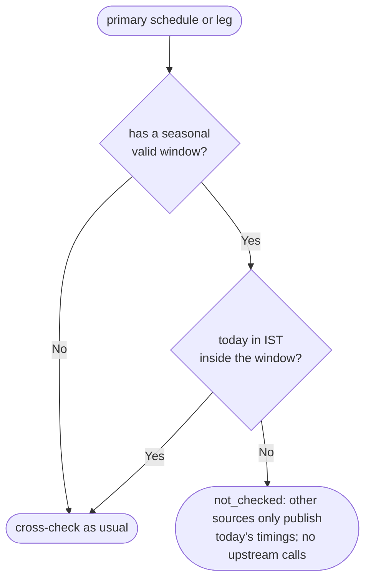
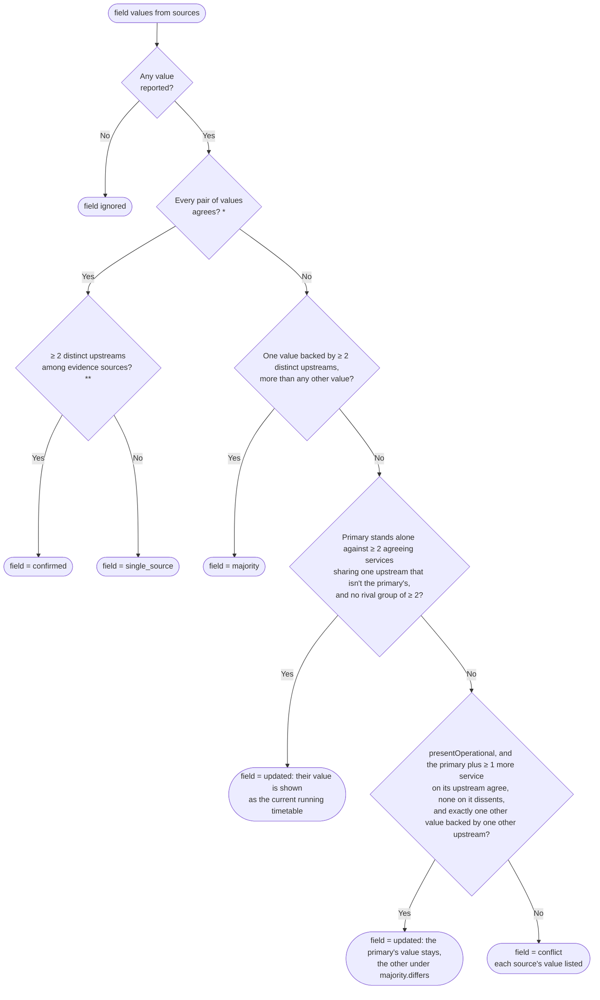
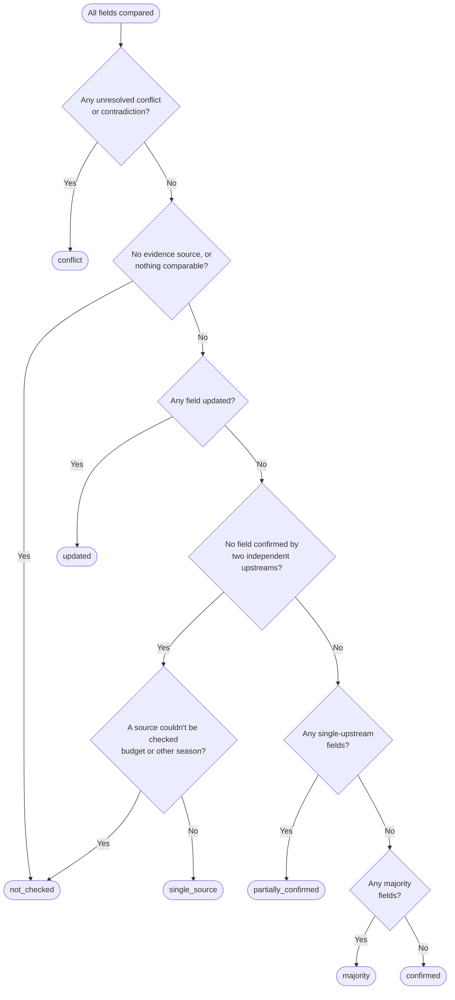
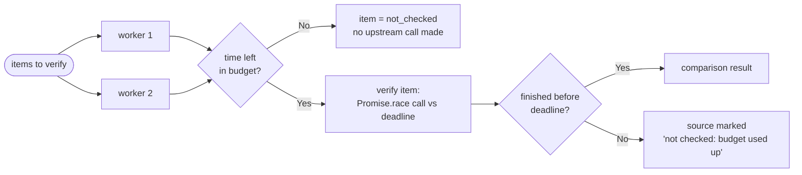

# Cross-source verification

[← Design index](../README.md) · [← Request flow and providers](04-request-flow.md) · [Punctuality history →](06-punctuality.md)

> **Diagram conventions:** C4 model (structure), UML sequence/class/deployment diagrams, ISO 5807-style flowcharts (rounded = start/end, rectangle = process, diamond = decision, parallelogram = I/O). Diagrams are Mermaid.

## `find_trains_between` with cross-source verification

---

## Station code equivalence

Some stations have several codes because they were renamed or recoded, e.g. NJPS → NJP. `StationCodes` (`src/core/station-codes.ts`) maps every code in a verified equivalence group (`data/station_equivalences.json`) to the code current sources use. It is applied at four points:
- **Tool inputs:** `requireStation` returns the current code.
- **Local datasets at load:** station rows merge under the current code. The current code's own row wins, gaps are filled from alias rows, and every name stays searchable.
- **Remote source queries:** sources are always asked with the current code.
- **Before comparing:** `canonSchedule` / `canonLeg` / DelayHistory station codes.

So one station under two codes is never treated as two stations or reported as a conflict. A group is only accepted with two independent pieces of evidence (see [Offline data pipelines](08-data-pipelines.md#station-code-equivalences)).

---

## Seasonal timings

Some trains, mainly on the Konkan route, run to different timings in the monsoon. They appear once per yearly window (`valid: {from, to}` as MM-DD). Each request resolves "today" in IST once, and the variant valid on the travel date (or today) is the one served. eRail and ConfirmTkt only publish the timings in force today, so timings for another season can't be confirmed or refuted by them:

---

## Verification status decision (`Comparison`)

Each compared **field** is classified first; the item's overall status then follows.

A settled value that replaces the primary's is recorded under `corrections` with its `basis` (`majority` or `updated`, the latter naming the `shared_upstream`). It can only be shown where the caller can apply it; otherwise the field stays a conflict.

**The mirror rule (`PRIMARY_SOURCE=confirmtkt`).** With ConfirmTkt presented first, the verifier sets `presentOperational`. `updated` then also covers the mirror case: the primary (an evidence source) and at least one other service share its upstream and agree, no service on that upstream reports anything else, and exactly one other value differs, backed by exactly one other upstream (in practice the printed timetable). The primary's value is already the one shown, so no correction is recorded and `applyCorrections` changes nothing. The conflict entry carries `majority: { value, sources, basis: "updated", shared_upstream, differs: [{ source, value }] }`, where `differs` discloses the printed value. It is still not independent confirmation: `confirmed` always needs two distinct upstreams. ConfirmTkt alone against the printed timetable, a dissenting operational service, or two other values stay `conflict`. When independent upstreams outvote ConfirmTkt (e.g. the official timetable and the archive on a station field), the ordinary majority rule applies and the correction replaces ConfirmTkt's value. Without the setting the rule is off.

\* Equality is exact for times, days and codes, set equality for running days and classes, ±2 km for distance, ≤1 km for coordinates. Comparison ignores key order.
\*\* Evidence is counted by **upstream** (`ProviderInfo.upstream`): eRail, ConfirmTkt, RailRadar, etrain.info and NTES are tagged as Indian Railways' operational data and count once. **Not evidence:** the archived dataset for timetable facts; coordinates a dataset copied from another (`coordinatesIndependent` must be declared by local datasets, so this fails closed); a second identical coordinate pair.

**Source independence.** eRail, ConfirmTkt and RailRadar are separate services, but they very likely draw on the same Indian Railways operational data (NTES/CRIS). RailRadar's schedules matched eRail's on 628 of 628 stop times checked. Their agreement against TAG therefore shows the current running timetable (usually a retiming since TAG was printed), not two independent measurements. That is the right value to show a traveller, and the TAG original is always disclosed.

**Applying settled values.** When a field is settled, the settled value is the one shown. That happens either as `majority` (two or more independent upstreams agree) or as `updated` (the operational-data services agree unanimously against the printed timetable, typically a retiming). Schedules, trains-between results and station-board rows show it, with durations and halts recalculated. The original value is listed under `verification.corrections` with its `basis`. Connection search plans on the primary timetable, because layovers depend on it; it only lists corrections on each leg, so a leg can show `updated` while still displaying the printed value. Contradictions, such as a source that doesn't list the train at all, are never settled.

A **contradiction** is a source that answered but does not list the train (`listed: false`) or the halt. Parts can't be better verified than their whole: stop statuses are capped by the schedule's status, and a journey takes its weakest leg.

---

## Budgeted fan-out (`Verifier.map` / `bounded`)

Concurrency is 2 by default, so rate-limited upstreams aren't flooded with calls that would outlive the budget. The primary answer is never subject to the verification budget.

---

[← Design index](../README.md) · [← Request flow and providers](04-request-flow.md) · [Punctuality history →](06-punctuality.md)
