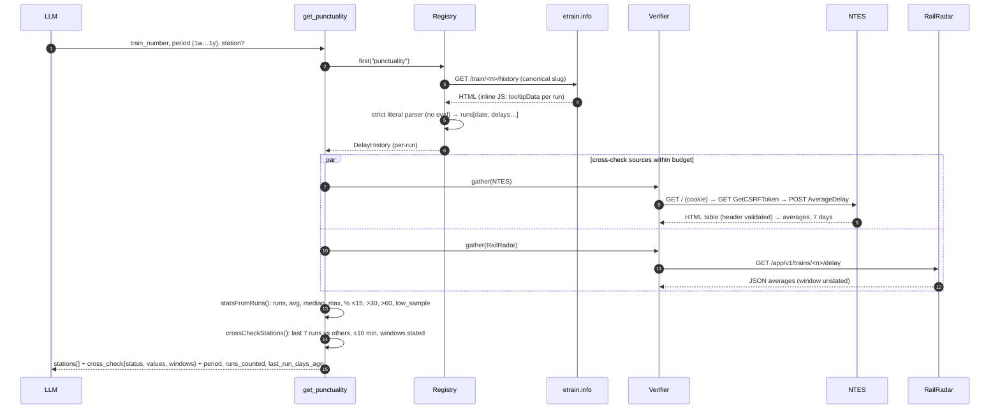

# Punctuality history

[← Design index](../README.md) · [← Cross-source verification](05-verification.md) · [Connection search →](07-connections.md)

> **Diagram conventions:** C4 model (structure), UML sequence/class/deployment diagrams, ISO 5807-style flowcharts (rounded = start/end, rectangle = process, diamond = decision, parallelogram = I/O). Diagrams are Mermaid.

## `get_punctuality`

Measure compared: **departure** at the origin, **arrival** elsewhere (falling back to the other when absent).

---

[← Design index](../README.md) · [← Cross-source verification](05-verification.md) · [Connection search →](07-connections.md)
