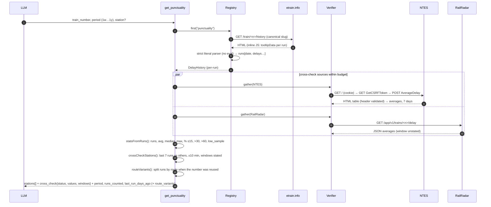
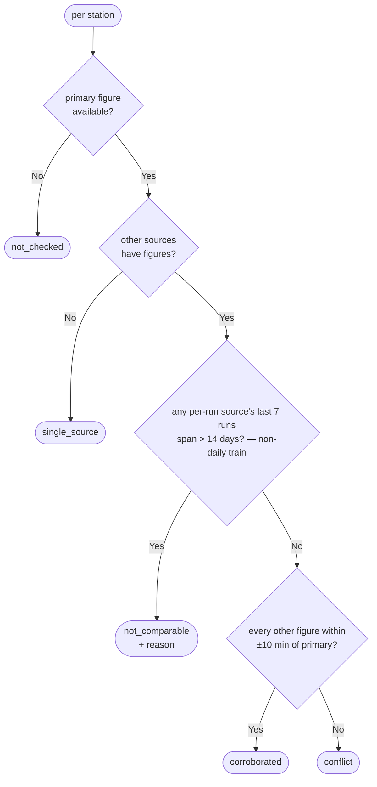

# Punctuality history

[← Design index](../README.md) · [← Cross-source verification](05-verification.md) · [Connection search →](07-connections.md)

> **Diagram conventions:** C4 model (structure), UML sequence/class/deployment diagrams, ISO 5807-style flowcharts (rounded = start/end, rectangle = process, diamond = decision, parallelogram = I/O). Diagrams are Mermaid.

## `get_punctuality`

Measure compared: **departure** at the origin, **arrival** elsewhere (falling back to the other when absent).

### Reused train numbers (`route_variants`)

Special-train numbers are reused across seasons, often on different routes, and the per-run source files every run under the number. `routeVariants()` (in `src/core/punctuality.ts`) splits a per-run history by route using only the source's own data. Data is often missing, so a station that was never recorded doesn't count as evidence on its own. The rules rely on stations recorded in every run:

1. A run's **ends** are its first and last stations with data. Runs with no data are ignored.
2. A route is **established** only when at least 2 runs share exactly the same ends, and the two ends are different stations. Its **core** stations are those recorded in all of its runs, which always includes its ends.
3. Every pair of established routes must **differ**:
   - Each route has a core station the other never recorded. A one-off reading can't create a difference.
   - No run outside the established routes recorded a marking station of both. Such a run shows it is one train with gaps. A third route's runs may cover both, so they are not counted here.
   - Their date ranges don't overlap, which separates seasons from interleaved runs.
4. Every other run with data is attributed to a route only when **that route's span (first to last station) is the only one containing the run**, the route recorded every station the run did, and the run's date isn't inside another route's range. Otherwise it is left out (`unassigned`, mentioned in the note). If attributing runs would make two routes overlap in time, there is no split.

Missed splits are accepted to avoid false ones. One route repeating around another (A-B-A, e.g. the same Holi and Diwali special with a summer route in between) and a route that is a section of another (e.g. DDR→NZM within a DDR→NDLS that calls at NZM) are not split. A single route could still be split if a source stopped recording one end station for a whole season while consistently recording the other. The same applies to consecutive seasons each missing a different end. Real reused specials look exactly like that, so it can't be ruled out from the data; it is accepted as unlikely.

When variants exist, `route_variants[]` gives each route's ends, dates, run count and per-station statistics, and a note says that `stations[]` combines them. Example: 04001 over a year splits into MMCT→NDLS (December), DDR→NDLS (February–March) and DDR→NZM (April–July). Daily trains with occasional gaps are not split. The cross-check still uses the combined figures.

---

[← Design index](../README.md) · [← Cross-source verification](05-verification.md) · [Connection search →](07-connections.md)
