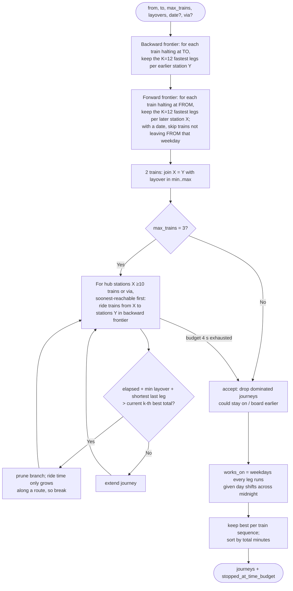

# Connection search

[← Design index](../README.md) · [← Punctuality history](06-punctuality.md) · [Offline data pipelines →](08-data-pipelines.md)

> **Diagram conventions:** C4 model (structure), UML sequence/class/deployment diagrams, ISO 5807-style flowcharts (rounded = start/end, rectangle = process, diamond = decision, parallelogram = I/O). Diagrams are Mermaid.

## `find_connections` (bounded 2–3 train search)

The tool then verifies every leg (see [Cross-source verification](05-verification.md#verification-status-decision-comparison)) and reports each journey's weakest status. The search is heuristic and bounded; responses state that an empty result doesn't prove no connection exists.

---

[← Design index](../README.md) · [← Punctuality history](06-punctuality.md) · [Offline data pipelines →](08-data-pipelines.md)
