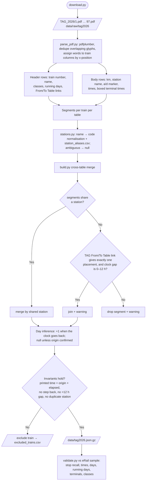
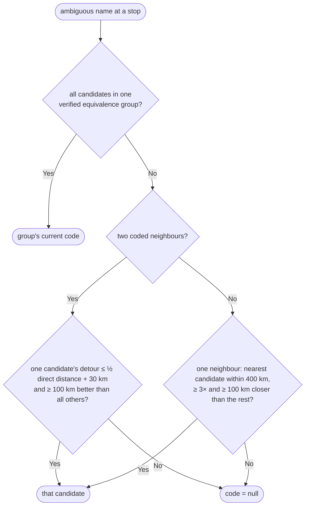
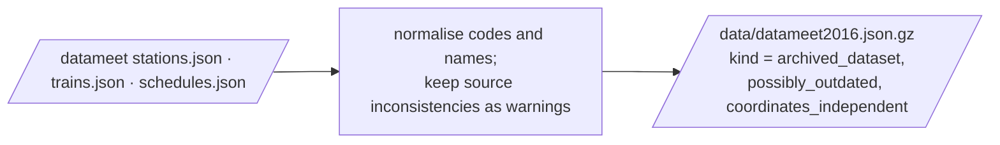

# Offline data pipelines

[← Design index](../README.md) · [← Connection search](07-connections.md) · [Deployment and cross-cutting concerns →](09-deployment-and-operations.md)

> **Diagram conventions:** C4 model (structure), UML sequence/class/deployment diagrams, ISO 5807-style flowcharts (rounded = start/end, rectangle = process, diamond = decision, parallelogram = I/O). Diagrams are Mermaid.

## Offline data pipelines

## Official timetable ETL (`scripts/tag/`)

Validation (sample 150; reproduce with `python3 scripts/tag/validate.py --sample 150`):
- stops found on eRail's route: 98.2%
- times equal: 88.0% (mismatches checked against the PDF are retimings since TAG went to press, or TAG typos)
- day numbers: 99.9%
- running days: 98.6%
- both terminals present: 91.1%
- km: always null (per-table baselines)

## Seasonal (monsoon) variants

TAG prints separate monsoon pages for Konkan-route trains. The parser reads the window from the page title ("Monsoon Timings : 10th June to 31st October" gives 06-10..10-31) and emits two variants per train: monsoon, and regular with the complementary window. Each variant must pass every invariant on its own. If one can't be parsed reliably, it is dropped with a warning, and the other keeps its window so it is never treated as all-year. Current figures: 103 seasonal trains. Against eRail, which shows the monsoon timings in force on 4 Oct, the monsoon variants match 86.2% of times and the regular ones 49.5%.

## Station-name disambiguation

When a TAG station name fits several codes (datameet same-name sets, plus `scripts/tag/station_ambiguous.csv`), the code is chosen from the train's neighbouring coded stops:

## Station code equivalences

`scripts/tag/build_equivalences.py` writes `data/station_equivalences.json`. Candidate pairs come from TAG-vs-eRail route alignment and from near-duplicate datameet entries. A pair is accepted only with **two independent pieces of evidence**:
- coordinates within 1 km in two sources (datameet and ConfirmTkt)
- a datameet duplicate entry
- route alignment, counted once, and never when the TAG code came from a hand-written alias

A pair is rejected if both codes are live stations in ConfirmTkt, or if they are more than 5 km apart. The current build has 19 groups.

## Archived dataset ETL (`scripts/build-snapshot.ts`)

Both pipelines emit the same `TimetableFile` format (`src/providers/timetable/format.ts`), so `LocalTimetableProvider` serves either.

---

[← Design index](../README.md) · [← Connection search](07-connections.md) · [Deployment and cross-cutting concerns →](09-deployment-and-operations.md)
