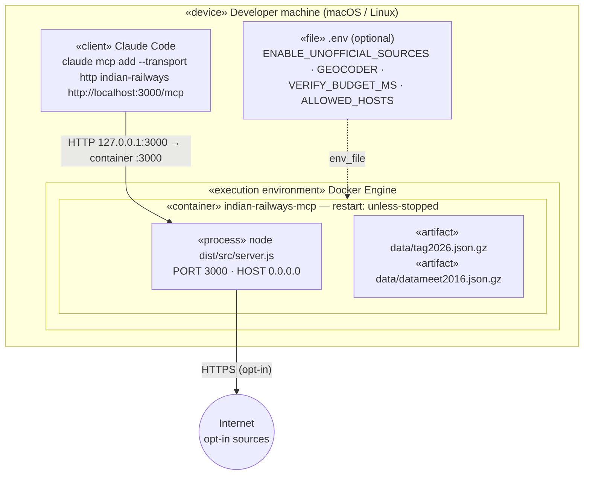

# Deployment and cross-cutting concerns

[← Design index](../README.md) · [← Offline data pipelines](08-data-pipelines.md) · [Extending and known limitations →](10-extending-and-limitations.md)

> **Diagram conventions:** C4 model (structure), UML sequence/class/deployment diagrams, ISO 5807-style flowcharts (rounded = start/end, rectangle = process, diamond = decision, parallelogram = I/O). Diagrams are Mermaid.

## Deployment

- The port is published on loopback only (`127.0.0.1:3000`), so the server isn't reachable from the LAN.
- Host-header validation defaults to `localhost,127.0.0.1` (DNS-rebinding protection).
- The container runs as the non-root `node` user, with a health check on `/healthz`.
- Memory use is about 310 MB with both datasets loaded.
- Optional hosting (any Docker host) only needs `ALLOWED_HOSTS` set to the public hostname.

---

## Cross-cutting concerns

| Concern | Approach |
|---|---|
| **Never fabricate** | Typed errors instead of empty results. Unknown is `null`. Adapters reject unexpected response shapes (`UPSTREAM_UNAVAILABLE: unexpected response shape`) rather than partially filling. The ETL drops ambiguous values. |
| **Provenance** | Every response carries `source` (provider, kind, `data_as_of`, `possibly_outdated`, `retrieved_at`, fall-back notes) and, where cross-checked, `cross_checked_with`. |
| **Error model** | `INVALID_INPUT` stops the chain. Other codes fall through to the next provider. Tool errors return `{error: {code, message, next_step}}` with `isError: true`. Error text states facts and never instructs the model (connector-review rule). |
| **Time** | All times are IST. Weekdays are computed in UTC from ISO dates (independent of the host timezone). `todayInIndia()` adds +05:30. |
| **Security** | Read-only tools only. No credentials stored. Host-header validation. Loopback port binding. No eval in parsers. |
| **Legal / terms of use** | Unofficial sources are off by default. NTES results are never persisted (≤30 min in-memory cache). Identifying User-Agent for Nominatim and polite rate limits throughout. |
| **Performance** | In-memory indexes: station → calls and train → schedule. Dataset load is about 0.6 s. The 2-train connection search runs in tens of milliseconds; the 3-train search is bounded at 4 s. Verification is bounded by `VERIFY_BUDGET_MS` (default 20 s). |
| **Testing** | vitest: unit tests (time, connections, verification, punctuality), provider tests against hand-written synthetic fixtures (stubbed fetch, no network), and MCP protocol tests in-memory and over real HTTP. |

---

[← Design index](../README.md) · [← Offline data pipelines](08-data-pipelines.md) · [Extending and known limitations →](10-extending-and-limitations.md)
