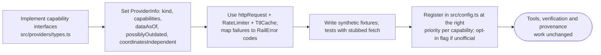

# Extending and known limitations

[← Design index](../README.md) · [← Deployment and cross-cutting concerns](09-deployment-and-operations.md)

> **Diagram conventions:** C4 model (structure), UML sequence/class/deployment diagrams, ISO 5807-style flowcharts (rounded = start/end, rectangle = process, diamond = decision, parallelogram = I/O). Diagrams are Mermaid.

## Extending the system

To add a data provider:

The kind you declare decides how the verifier counts the source as evidence (`countsAsEvidence`):
- `official_timetable`, `unofficial_api` and `commercial_api` count for all facts.
- `archived_dataset` counts for station facts only.

---

## Known limitations

- **Official timetable coverage.**
  - 197 trains are excluded because they can't be parsed reliably.
  - About 9% of trains lack one terminal.
  - Times reflect TAG as printed: about 12% of sampled stop times differ from current running because of later retimings. The cross-checks flag these.
- **Distances** are null in the official dataset.
- **Unofficial sources** can change or break without notice. Failures surface as typed errors, never as wrong data.
- **Punctuality** windows only partly overlap between sources, and etrain.info lags about a week. Cross-check statuses mean similar behaviour over adjacent periods, not agreement on the same runs.
- **`find_connections`** is a bounded heuristic. It changes trains within a station only, not between nearby stations.
- **No live position**, by design.

---

[← Design index](../README.md) · [← Deployment and cross-cutting concerns](09-deployment-and-operations.md)
